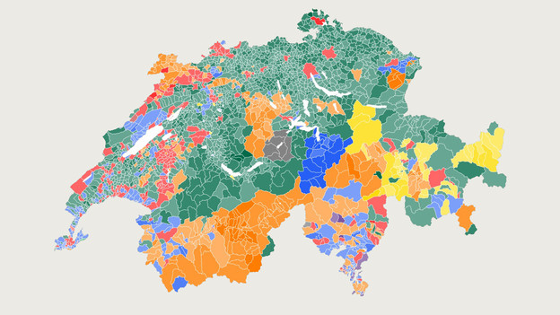

### nr-Jahreskonferenz 2015
## Transparenz  und Reproduzierbarkeit im #DDJ

### Effizientes Arbeiten  mit R und GitHub

Timo Grossenbacher, SRF Data

[@grssnbchr](http://twitter.com/grssnbchr)

[@srfdata](http://twitter.com/srfdata)

Präsentation vefügbar unter [grssnbchr.github.io/nr15-rddj](http://grssnbchr.github.io/nr15-rddj)

---

### Über mich

Ursprünglich: Geographie / Informatik / Tages-Anzeiger

Seit November 2014 beim Team von SRF Data als **Programmierer** und **Datenjournalist** 

--- #slide-3-tweet

### Warum Transparenz?

<aside class="notes">Vor ein paar Wochen hat sich eine Schweizer Politikerin bei uns über ein neues Tool beschwert. In diesem Fall war der Vorwurf der Pseudoobjektivität völlig unbegründet - einen wunden Punkt des Datenjournalismus trifft die Dame mit dem Vorwurf jedoch trotzdem.</aside>

Deswegen: 

<blockquote class="twitter-tweet" data-conversation="none" data-cards="hidden" data-partner="tweetdeck">
<a href="https://twitter.com/brenntr">@brenntr</a> <a href="https://twitter.com/fljan">@fljan</a> <a href="https://twitter.com/srfdata">@srfdata</a> <a href="https://twitter.com/srfnews">@srfnews</a> sag ich doch, das mit dem Datenjournalismus ist eine heikle Sache und mündet zu oft in Pseudoobjektivität
&mdash; Jacqueline Badran (@JayBadran) <a href="https://twitter.com/JayBadran/status/613021865007820800">June 22, 2015</a></blockquote>

--- 

### Warum Transparenz?

<aside class="notes">Datenjournalistische Arbeit kann nur selten ausführlich erklärt werden - schon gar nicht in einem (Zeitungs-)Artikel. Während man bei klassischen Recherchen schnell mal erklären kann, dass man z.B. eine wichtige Info in einer Gerichtsakte gefunden hat, ist es beim DDJ schwieriger.
Datenjournalisten wissen, dass die Resultate ihrer Arbeit nicht per se objektiver ist als die von anderen Journalisten. Sie sollten sich aber auch bewusst sein, dass beliebig komplexe Auswertungen Gefahr laufen, ihre Objektivität ganz zu verlieren. Nämlich dann, wenn unüberlegt und ungerechtfertigt Entscheidungen getroffen werden, die das Resultat einer Analyse stark verändern könn(t)en. Wenn man diese Schritte nicht transparent macht, dann besteht in der Tat die Gefahr der Pseudoobjektivität. Mit der Offenlegung unserer Methoden machen wir uns zwar angreifbar, aber wir können uns auch besser rechtfertigen. Im Idealfall weisen uns Leser konstruktiv auf Fehler hin, die wir beim nächsten Mal vermeiden können.</aside>

Das **Problem**: Datenjournalistische Arbeit kann nur selten ausführlich erklärt werden

.fragment Jeder zusätzliche Prozessierungsschritt bedingt neue *Entscheidungen*  – Gefahr der **"Pseudo-Objektivität"** steigt

.fragment Interessierte sollten die Chance erhalten, uns zu hinterfragen *und* uns zu korrigieren

---

### Stufen der Transparenz

<aside class="notes">Transparenz kann man verschiedentlich auslegen, ich habe einmal versucht, eine Abstufung zu machen. Jede Stufe bedingt mehr oder weniger die vorhergehenden Stufen.</aside>

.fragment 1. Quellenangaben (leider nicht selbstverständlich...)

.fragment 2. Beschreibung und Rechtfertigung der Methoden, z.B. mit einem [Werkstattbericht](http://www.digitalerwandel.de/2013/04/23/wir-bauen-uns-eine-nachrichtenquelle-werkstattbericht-zum-flugrouten-radar/)

.fragment 3. Offenlegung der Rohdaten und prozessierten Daten (z.B. wie bei [fivethirtyeight.com](https://github.com/fivethirtyeight/data))

.fragment 4. Offenlegung der Methoden, volle *Reproduzierbarkeit* (z.B. wie bei der [NPR Military Gear Story](http://blog.apps.npr.org/2014/09/02/reusable-data-processing.html))

--- 

### Warum Reproduzierbarkeit?

<aside class="notes">Ohne Reproduzierbarkeit keine echte, vollständige Transparenz. Richtige Reproduzierbarkeit bedingt, dass von den absoluten Rohdaten bis zum (analytischen) Endergebnis alle Schritte nachvollziehbar und ausführbar sind. Eigentlich ist dies nur zu erreichen, wenn man die Schritte "aufzeichnet", und dafür eignet sich am besten Code: Sprich, die Datenanalyse selber besteht aus einem Skript, dass einen Input nimmt und einen Output generiert. Das bringt zwei Vorteile mit sich: Man kann das Skript wiederverwenden, z.B. bei neuen Daten. Und das ganze ist automatisiert, sprich, wir können Kaffee trinken gehen, während der Computer rechnet. Die Automatisierung kann wiederum dabei helfen, Fehler zu vermeiden, die man beim manuellen Bearbeiten, z.B. bei Unkonzentriertheit, machen könnte.</aside>

.fragment 1. Transparenz

.fragment 2. Wiederverwendbarkeit 

.fragment 3. Automatisierung 

.fragment 3b. Reduzierte Fehleranfälligkeit

--- 

### Genug der Theorie!!! 

<aside class="notes">Im folgenden nun zwei Beispiele, wie wir bei SRF Data konkret versuchen, das zu leben, was ich hier predige.</aside>

<small>Bildquelle: Flickr.com</small>

---

### Wie wir versuchen, transparent zu sein

<aside class="notes">Im selben Zug möchte ich zwei Tools bzw. Ideen präsentieren, wie man mit Technologie Transparenz schaffen kann.</aside>

(und effizient zu arbeiten...)

[R](http://r-project.org) / [RMarkdown](http://rmarkdown.rstudio.com/)

[GitHub](http://github.com)

---

### Beispiel 1: Rüstungsexporte

Publizierter Artikel: [Hier](http://www.srf.ch/news/schweiz/notrecht-als-letztes-mittel-gegen-heikle-ruestungsexporte)

Methodik und Rohdaten: [Hier](http://srfdata.github.io/1503-seco-dual-use-goods/)

--> DEMO

---

### Beispiel 1: Rüstungsexporte

* Auswertung der Daten in R:
 * Reinladen
 * Vorprozessieren (messy -> tidy)
 * Erste Auswertungen inkl. Plots
 
* Publikation als Markdown-HTML
* Publikation auf GitHub Pages:
 * Automatisiert über Shell-Skript

---

### Beispiel 2: Wahlen 2015

<aside class="notes">Beispiel P1: Interaktive Visualisierung mit Shiny; Beispiel P3: Vorprozessieren für Entwickler</aside>

Publizierte Artikel: [Hier](http://www.srf.ch/news/wahlen-15/wahlkampf/so-haben-die-schweizer-gemeinden-seit-1971-gewaehlt) oder [hier](http://www.srf.ch/news/wahlen-15/von-listenglueck-und-proporzpech)

Methodik / interaktive Auswertung: z.B. [hier](https://grssnbchr.shinyapps.io/elections15-project1)

--> DEMO

--- 

### Beispiel 2: Wahlen 2015 

* Vor allem Vorprozessierung für Visualisierung 
* Daten und Methoden wurden noch nicht veröffentlicht, ist aber geplant
* Interaktive Visualisierungen mit Shiny - u.a. für Kollegen (z.B. beim Radio)
* Vorprozessierung von "Hand" kaum vorstellbar
* Und immer wieder:

`git status`

---

### Fazit

**R** ermöglicht uns:

* alle Prozessierungsschritte an einem Ort zu *bündeln*
    * einlesen
    * vorprozessieren
    * auswerten
    * visualisieren
    * vorbereiten
    * etc.
 
* Reproduzierbarkeit & Publikation der Methoden mit **Markdown**

---

### Fazit

**GitHub** ermöglicht uns:

* Austausch von Code und Daten (intern und extern)
* Schnelle Publikation über GitHub Pages
* Versionsvergleiche
    
---

*Wir sind erst am Anfang und probieren viel aus.* 
*Klar ist: Transparenz ist notwendig - und machbar!*

---

## Blut geleckt?

  

[rddj.info - damit bringt Ihr Euch R bei](http://rddj.info)

---

# Danke

## Fragen? 

[@grssnbchr](http://twitter.com/grssnbchr)

[@srfdata](http://twitter.com/srfdata)

Diese Präsentation ist verfügbar (und reproduzierbar) unter [github.com/grssnbchr/nr15-rddj](https://github.com/grssnbchr/nr15-rddj/blob/gh-pages/index.md)
<small>Gemacht mit [slidify](https://github.com/ramnathv/slidify) und [revealjs](https://github.com/hakimel/reveal.js/)</small>
