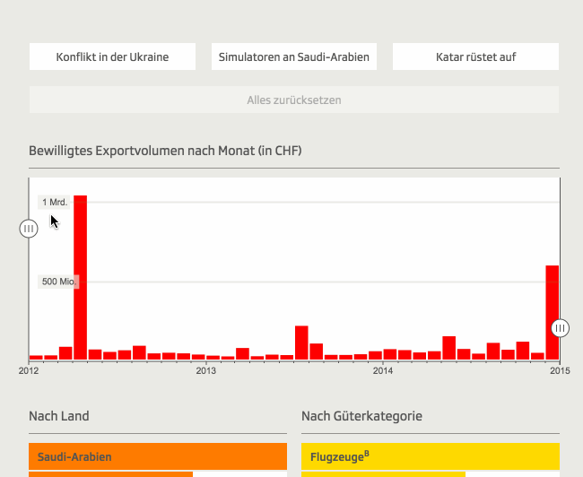

### nr-Datenlabor
## Reproduzierbarkeit im #DDJ

### Warum und wie? 

Timo Grossenbacher, SRF Data

[@grssnbchr](http://twitter.com/grssnbchr)

[@srfdata](http://twitter.com/srfdata)

Präsentation vefügbar unter [grssnbchr.github.io/nrdl-rddj](http://grssnbchr.github.io/nrdl-rddj)

---

### Über mich

Ursprünglich: Studium Geographie & Informatik / Tages-Anzeiger

Seit November 2014 beim Team von SRF Data als **Programmierer** und **Datenjournalist** 

---

### SRF Data

---

### SRF Data

.fragment  Mehr Rechercheteam, weniger Dienstleister

.fragment  Ideen pitchen, Daten bekommen / sammeln, scrapen / einklagen

.fragment  Daten bereinigen, visualisieren, analysieren, Story finden

.fragment  Publikation auf srf.ch -> Übersicht, Interaktivität

.fragment  Publikation in Radio und/oder TV -> Anekdoten, Details 

.fragment  [Portfolio](http://srf.ch/data)

---

### Warum Reproduzierbarkeit?

<aside class="notes">Ohne Reproduzierbarkeit keine echte, vollständige Transparenz. Richtige Reproduzierbarkeit bedingt, dass von den absoluten Rohdaten bis zum (analytischen) Endergebnis alle Schritte nachvollziehbar und ausführbar sind. Eigentlich ist dies nur zu erreichen, wenn man die Schritte "aufzeichnet", und dafür eignet sich am besten Code: Sprich, die Datenanalyse selber besteht aus einem Skript, dass einen Input nimmt und einen Output generiert. Das bringt zwei Vorteile mit sich: Man kann das Skript wiederverwenden, z.B. bei neuen Daten. Und das ganze ist automatisiert, sprich, wir können Kaffee trinken gehen, während der Computer rechnet. Die Automatisierung kann wiederum dabei helfen, Fehler zu vermeiden, die man beim manuellen Bearbeiten, z.B. aus Unkonzentriertheit, machen könnte.</aside>

.fragment 1. Transparenz

.fragment 2. Automatisierung 

.fragment 2b. Wiederverwendbarkeit 

.fragment 2c. Reduzierte Fehleranfälligkeit

--- 

### Warum Transparenz?

<aside class="notes">Datenjournalistische Arbeit kann nur selten ausführlich erklärt werden - schon gar nicht in einem (Zeitungs-)Artikel. Während man bei klassischen Recherchen schnell mal erklären kann, dass man z.B. eine wichtige Info in einer Gerichtsakte gefunden hat, ist es beim DDJ schwieriger.
Datenjournalisten wissen, dass die Resultate ihrer Arbeit nicht per se objektiver ist als die von anderen Journalisten. Sie sollten sich aber auch bewusst sein, dass beliebig komplexe Auswertungen Gefahr laufen, ihre Objektivität ganz zu verlieren. Nämlich dann, wenn unüberlegt und ungerechtfertigt Entscheidungen getroffen werden, die das Resultat einer Analyse stark verändern könn(t)en. Wenn man diese Schritte nicht transparent macht, dann besteht in der Tat die Gefahr der Pseudoobjektivität. Mit der Offenlegung unserer Methoden machen wir uns zwar angreifbar, aber wir können uns auch besser rechtfertigen. Im Idealfall weisen uns Leser konstruktiv auf Fehler hin, die wir beim nächsten Mal vermeiden können.</aside>

Das **Problem**: Datenjournalistische Arbeit kann nur selten ausführlich erklärt werden

.fragment Jeder zusätzliche Prozessierungsschritt bedingt neue *Entscheidungen*  – Gefahr der **"Pseudo-Objektivität"** steigt

.fragment Interessierte sollten die Chance erhalten, uns zu hinterfragen *und* uns zu korrigieren

.fragment vgl. Vortrag von [Fernando Perez](http://www.bbc.com/news/magazine-22223190) gestern

---

### Stufen der Transparenz

<aside class="notes">Transparenz kann man verschiedentlich auslegen, ich habe einmal versucht, eine Abstufung zu machen. Jede Stufe bedingt mehr oder weniger die vorhergehenden Stufen.</aside>

1. Quellenangaben (leider nicht selbstverständlich...)

2. Beschreibung und Rechtfertigung der Methoden, z.B. mit einem [Werkstattbericht](http://www.digitalerwandel.de/2013/04/23/wir-bauen-uns-eine-nachrichtenquelle-werkstattbericht-zum-flugrouten-radar/)

3. Offenlegung der Rohdaten und prozessierten Daten (z.B. wie bei [fivethirtyeight.com](https://github.com/fivethirtyeight/data))

4. Offenlegung der Methoden, volle *Reproduzierbarkeit* (z.B. wie bei der [NPR Military Gear Story](http://blog.apps.npr.org/2014/09/02/reusable-data-processing.html))

--- 

### Exkurs: Wissenschaft

<aside class="notes">Meine persönliche Erfahrung ist: Wissenschaft ist heute alles andere als reproduzierbar</aside>

 * [Studie in Nature, 2012](http://www.nature.com/nature/journal/v483/n7391/full/483531a.html): 47 von 53 Studien in der Krebsforschung sind nicht reproduzierbar

 * Portale wie [PLOS one](http://www.plosone.org/) versuchen, Wissenschaft reproduzierbarer zu machen

---

### Exkurs: Wissenschaft

<aside class="notes">Dieses Buch kann ich sehr empfehlen</aside>

[Statistics Done Wrong](http://www.statisticsdonewrong.com/)

---

### In der Praxis

<aside class="notes">Im folgenden nun ein paar Beispiele, wie wir bei SRF Data konkret versuchen, das zu leben, was ich hier predige.</aside>

Bezüglich Transparenz: [srfdata.github.io](http://srfdata.github.io)

Bezüglich Automatisierung: Eidgenössische Wahlen 2015

---

### Tools of Trade

<aside class="notes">Im selben Zug möchte ich zwei Tools bzw. Ideen präsentieren, wie man mit Technologie Transparenz und Reproduzierbarkeit schaffen kann.</aside>

[R](http://r-project.org) / [RMarkdown](http://rmarkdown.rstudio.com/)

[Git / GitHub](http://github.com)

---

### Tools of Trade

---

### Transparenz & Open Data

---

### Rüstungsexporte

Publizierter Artikel: [Hier](http://www.srf.ch/news/schweiz/notrecht-als-letztes-mittel-gegen-heikle-ruestungsexporte)

Methodik und Rohdaten: [Hier](http://srfdata.github.io/1503-seco-dual-use-goods/)

---

### Rüstungsexporte

* Auswertung der Daten in R:
 * Reinladen
 * Vorprozessieren (messy -> tidy)
 * Erste Auswertungen inkl. Plots
 
* Publikation als Markdown-HTML
* Publikation auf GitHub Pages:
 * Automatisiert über [Shell-Script](https://github.com/grssnbchr/rddj-reproducibility-workflow)

---

### Eidgenössische Wahlen 2015

<small>Bildquelle: Jonas Bayona</small>

--- #wahlen-studio

&nbsp;

--- #wahlen-konrad data-background

&nbsp;

---

### Demo

---

### Fazit

**R** ermöglicht uns:

* alle Prozessierungsschritte an einem Ort zu *bündeln*
    * einlesen
    * vorprozessieren
    * auswerten
    * visualisieren
    * vorbereiten
    * etc.
 
* Reproduzierbarkeit & Publikation der Methoden mit **Markdown**

---

### Automate EVERYTHING!

<small>Bildquelle: giphy.com</small>

.fragment <h3>...and make it reproducible.</h3>

---

## Blut geleckt?

[rddj.info - damit bringt Ihr Euch R bei](http://rddj.info)

[Coursera "Developing Data Products"](https://www.coursera.org/course/devdataprod)

[grssnbchr/rddj-reproducibility-workflow](https://github.com/grssnbchr/rddj-reproducibility-workflow)

The next big thing: [Project Jupyter](https://try.jupyter.org/)

Auch spannend: [Brian Keegan calls out 538 for openness in #ddj](http://www.brianckeegan.com/2014/04/the-need-for-openness-in-data-journalism/)

---

# Danke

## Fragen? 

[@grssnbchr](http://twitter.com/grssnbchr)

[@srfdata](http://twitter.com/srfdata)

Diese Präsentation ist verfügbar (und reproduzierbar) unter [github.com/grssnbchr/nrdl-rddj](https://github.com/grssnbchr/nrdl-rddj/blob/gh-pages/index.md)

<small>Gebaut mit [slidify](https://github.com/ramnathv/slidify) und [revealjs](https://github.com/hakimel/reveal.js/)</small>
